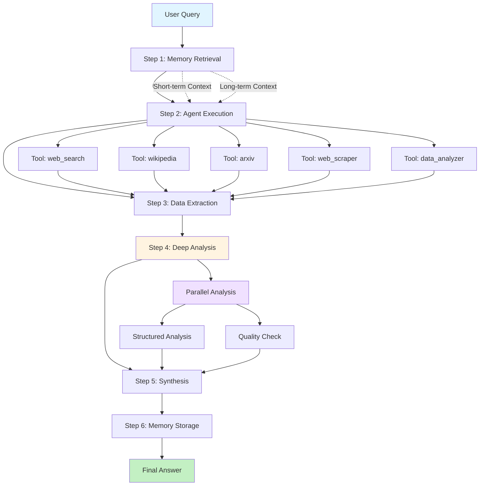
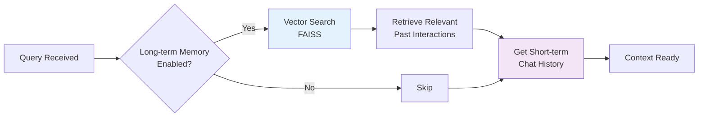
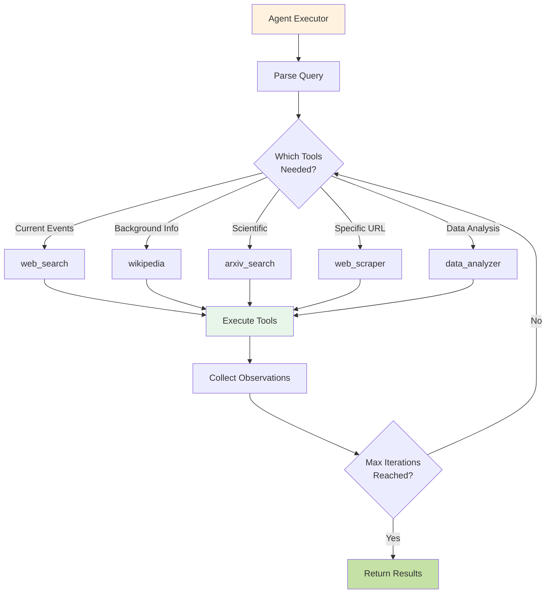
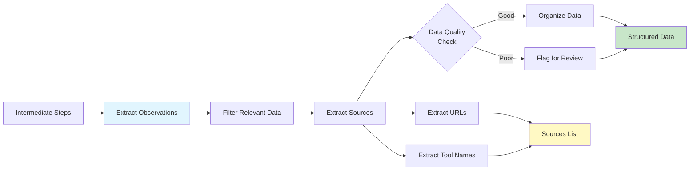
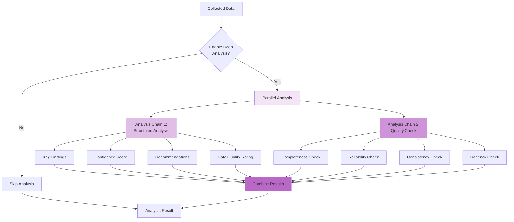
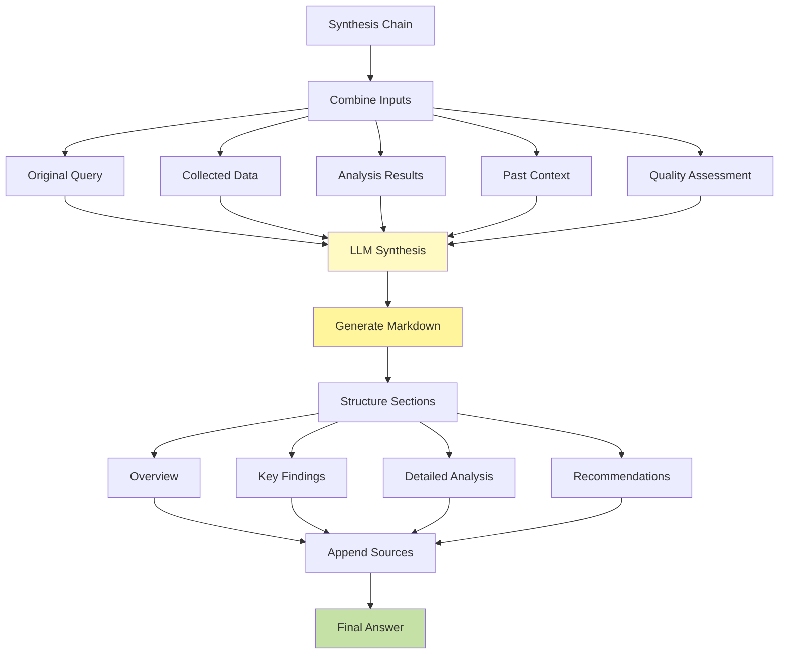
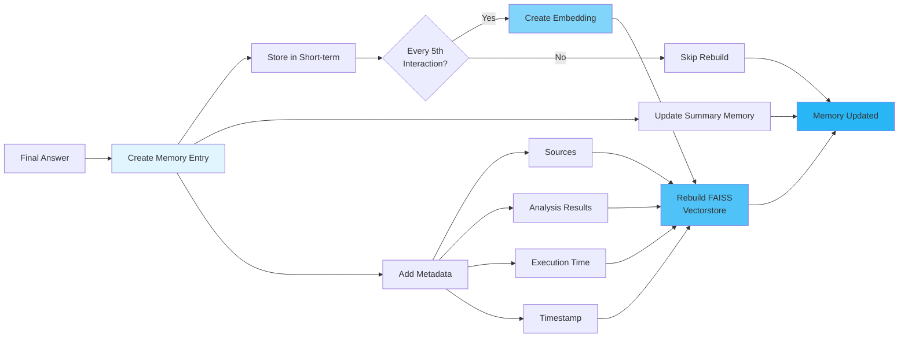
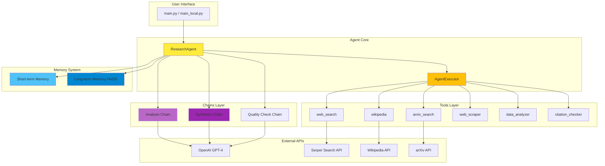

# 🤖 AI Research Assistant Agent

A production-level AI research assistant built with LangChain LCEL (LangChain Expression Language) that intelligently gathers, analyzes, and synthesizes information from multiple sources to provide comprehensive research answers.

## ✨ Features

### 🔍 **Multi-Source Information Gathering**
- **Web Search**: Real-time information from Google via SerpAPI (Serper implementation)
- **Wikipedia**: Background knowledge and encyclopedic information
- **Academic Papers**: Scientific research from arXiv
- **Web Scraping**: Detailed content extraction from specific URLs
- **Data Analysis**: Numerical and statistical analysis capabilities

### 🧠 **Intelligent Processing Pipeline**
1. **Information Collection**: Gathers data from multiple relevant sources
2. **Critical Analysis**: Evaluates reliability and cross-checks facts
3. **Quality Assessment**: Validates data completeness, consistency, and recency
4. **Synthesis**: Combines insights into coherent, well-structured answers
5. **Citation**: Properly cites sources for transparency

### 💾 **Hybrid Memory System**
- **Short-term Memory**: Maintains conversation context (last 10 messages)
- **Long-term Memory**: Vector-based storage in FAISS, rebuilds every 5 interactions
- **Summary Memory**: ConversationSummaryMemory for condensing long conversations
- **Context-aware**: Semantic search retrieves relevant past research (top 3 results)

### ⚡ **Advanced Capabilities**
- Parallel processing for faster analysis
- Structured output with confidence scores
- Real-time progress indicators
- Rich console formatting with Markdown support
- Error handling and retry mechanisms
- Configurable execution parameters

## 🏗️ Architecture

The agent follows a modular, production-ready architecture:

```
AI-Research-Assistant-Agent/
├── agents/
│   ├── research_agent.py    # Main agent orchestrator
│   ├── tools.py              # Research tools (search, scrape, analyze)
│   └── memory.py             # Hybrid memory system
├── chains/
│   ├── analysis_chain.py     # Deep analysis and comparison
│   ├── synthesis_chain.py    # Final answer synthesis
│   └── report_chain.py       # Report generation
├── utils/
│   ├── parsers.py            # Output parsers
│   └── validators.py         # Input validators
├── config.py                 # Configuration management
├── main.py                   # Production entry point
├── main_local.py             # Demo mode (no API calls)
└── requirements.txt          # Dependencies
```

## 🔄 Agent Workflow

### High-Level Execution Pipeline

The agent follows a sophisticated 6-step pipeline to process research queries:



### Detailed Step-by-Step Flow

#### **Step 1: Memory Retrieval** 🧠


**What Happens:**
- Searches long-term memory (FAISS vector store) for relevant past research
- Retrieves last 10 messages from short-term memory
- Combines context to inform current research

**Code Reference:**
```python
past_context = self.memory.get_relevant_context(query)
chat_history = self.memory.get_short_term_history()
```

---

#### **Step 2: Agent Execution** 🤖


**What Happens:**
- OpenAI function calling determines which tools to use
- Agent iteratively calls tools based on findings (max 5 iterations)
- Each tool returns observations (search results, articles, data)
- Agent decides if more information is needed

**Code Reference:**
```python
agent_result = await self.agent_executor.ainvoke({
    "input": query,
    "chat_history": chat_history,
    "tools": self.tools
})
```

---

#### **Step 3: Data Extraction** 📊


**What Happens:**
- Parses all tool execution results
- Extracts meaningful data from observations
- Identifies and catalogues sources (URLs, tool names)
- Filters out low-quality or irrelevant information

**Code Reference:**
```python
collected_data = self._extract_data_from_steps(intermediate_steps)
sources = self._extract_sources(intermediate_steps)
```

---

#### **Step 4: Deep Analysis** 🔬


**What Happens:**
- **Parallel Processing**: Runs two analysis chains simultaneously using `RunnableParallel`
  
  **Structured Analysis:**
  - Extracts key findings
  - Calculates confidence score (0-1)
  - Generates actionable recommendations
  - Rates data quality (High/Medium/Low)
  
  **Quality Check:**
  - Validates data completeness
  - Assesses source reliability
  - Checks for contradictions
  - Evaluates information recency

**Code Reference:**
```python
parallel_analysis = RunnableParallel({
    "structured_analysis": self.analysis_chain,
    "quality_check": self._create_quality_check_chain()
})
results = await parallel_analysis.ainvoke(analysis_input)
```

**Output Schema (Pydantic):**
```python
{
    "key_findings": List[str],
    "confidence_score": float,
    "data_quality": str,
    "recommendations": List[str],
    "sources_used": List[str]
}
```

---

#### **Step 5: Synthesis** ✨


**What Happens:**
- Synthesis chain combines ALL inputs into coherent answer
- GPT-4 generates well-structured Markdown output (temperature=0.3)
- Automatically formats with predefined sections per prompt template:
  - **Executive Summary**: 2-3 sentence overview
  - **Main Findings**: Organized by themes
  - **Analysis & Insights**: In-depth exploration
  - **Limitations & Gaps**: Acknowledges uncertainties
  - **Recommendations**: Actionable next steps
- Sources are appended separately (not part of synthesis chain output)

**Code Reference:**
```python
final_answer = await self.synthesis_chain.ainvoke({
    "original_query": query,
    "findings": collected_data,
    "analysis": json.dumps(analysis_result),
    "comparison": quality_assessment,
    "past_context": past_context
})
```

---

#### **Step 6: Memory Storage** 💾


**What Happens:**
- **Short-term Memory**: Adds query + answer to chat history (last 10 retained via `ConversationBufferWindowMemory`)
- **Summary Memory**: Updates conversation summary using `ConversationSummaryMemory`
- **Long-term Memory**: 
  - Creates Document with query + response + metadata
  - Appends to documents list
  - **Rebuilds FAISS vectorstore every 5 interactions** (not every time for performance)
  - Enables semantic search for future queries
- Future queries can retrieve top 3 most relevant past interactions

**Code Reference:**
```python
self.memory.add_interaction(
    query=query,
    response=final_answer,
    metadata={
        "sources": sources,
        "analysis": analysis_result,
        "execution_time": execution_time
    }
)
```

---

### Component Interaction Diagram



### Key Design Patterns

#### 1. **LCEL (LangChain Expression Language)**
The agent extensively uses LCEL for composability:
- `RunnableParallel`: Run analysis chains in parallel
- `RunnablePassthrough`: Pass data through pipeline
- `RunnableBranch`: Conditional execution paths

#### 2. **Function Calling (OpenAI Tools)**
- Agent autonomously decides which tools to use
- Structured output ensures reliable parsing
- Supports multi-step reasoning

#### 3. **Hybrid Memory Architecture**
- **Short-term**: Fast access to recent context
- **Long-term**: Semantic search for relevant history
- **Automatic**: No manual memory management needed

#### 4. **Error Resilience**
- Try-catch blocks at each step
- Graceful degradation (fallback to simpler modes)
- Retry logic for API calls

---

## 🚀 Quick Start

### Prerequisites

- Python 3.8+
- OpenAI API key
- Serper API key (for web search)

### Installation

1. **Clone the repository**
```bash
git clone https://github.com/Hills081199/AI-Research-Assistant-Agent.git
cd AI-Research-Assistant-Agent
```

2. **Install dependencies**
```bash
pip install -r requirements.txt
```

3. **Set up environment variables**

Create a `.env` file in the root directory:
```env
OPENAI_API_KEY=your_openai_api_key_here
SERPER_API_KEY=your_serper_api_key_here
```

### Usage

#### **Option 1: Demo Mode (No API Required)**

Run the demo with pre-configured example:
```bash
python main_local.py
```

This will run a demo research query without making any API calls, perfect for testing the UI and understanding the output format.

#### **Option 2: Production Mode (API Required)**

**Interactive Mode:**
```bash
python main.py
```

Then choose from example queries or enter your own research question.

**Single Query Mode:**

Edit `main.py` to set your query, then run:
```bash
python main.py
```

## 📊 Example Output

When you run a research query, you'll get:

```markdown
# Research Results

## Executive Summary
[2-3 sentence overview synthesizing the key points]

## Main Findings
**Theme 1: [Topic Area]**
- Finding 1 with supporting data
- Finding 2 with statistics

**Theme 2: [Topic Area]**
- Finding 3 with insights
- Finding 4 with context

## Analysis & Insights
[In-depth exploration of the findings, patterns, and connections between sources]

## Limitations & Gaps
- Acknowledged uncertainty or missing data
- Areas requiring further research
- Conflicting information (if any)

## Recommendations
- Actionable recommendation 1
- Actionable recommendation 2
- Next steps for further investigation

---
**Metadata:**
- Execution time: 2.5s
- Intermediate steps: 8
- Confidence: 85%
- Data Quality: High

**Sources:**
1. https://example.com/source1
2. https://example.com/source2
3. Tool: wikipedia
4. Tool: web_search
5. Tool: arxiv_search
```

## ⚙️ Configuration

Customize the agent behavior in `config.py`:

```python
class AgentConfig:
    # API Keys
    openai_api_key: str
    serper_api_key: str
    
    # Model Settings
    model_name: str = "gpt-4-turbo-preview"
    temperature: float = 0.1
    max_tokens: int = 4000
    
    # Agent Settings
    max_iterations: int = 5
    max_execution_time: int = 300  # seconds
    
    # Memory Settings
    memory_window: int = 10
    enable_long_term_memory: bool = True
    
    # Search Settings
    max_search_results: int = 5
    search_timeout: int = 30
    
    # Parallel Execution
    max_concurrent_tasks: int = 3
```

## 🛠️ Available Tools

The agent has access to 6 specialized research tools:

| Tool | Description | Key Features | Use Case |
|------|-------------|--------------|----------|
| **web_search** | Google search via SerpAPI | Returns top results with snippets and links | Current events, general information, trending topics |
| **wikipedia** | Wikipedia article lookup | Fetches article summaries | Background knowledge, person/event overviews, encyclopedic info |
| **arxiv_search** | Academic paper search from arXiv | Returns top 3 papers with titles, authors, summaries (max 5000 chars) | Scientific research, technical papers, academic studies |
| **web_scraper** | Extract content from specific URLs | Supports 'text', 'links', 'images', 'tables' extraction types | Detailed content from specific websites, structured data extraction |
| **data_analyzer** | Analyze numerical or text data | Supports 'statistics', 'trends', 'comparison', 'summary' analysis types | Calculate stats, detect patterns, summarize datasets |
| **citation_checker** | Verify claim reliability based on source | Heuristic-based scoring using domain reliability indicators | Fact-checking, source validation, confidence scoring |

**Note**: Tools are selected autonomously by the agent using OpenAI function calling based on the query context.

## 📝 Core Components

### Research Agent (`research_agent.py`)
- Orchestrates the entire research pipeline
- Manages tool execution and memory
- Coordinates analysis and synthesis chains

### Tools (`tools.py`)
- Implements 6+ specialized research tools
- Handles API integrations
- Provides fallback mechanisms

### Memory System (`memory.py`)
- **Short-term**: `ConversationBufferWindowMemory` (k=10 messages)
- **Long-term**: FAISS vectorstore with OpenAI embeddings, rebuilds every 5 interactions
- **Summary**: `ConversationSummaryMemory` for condensing very long conversations
- Semantic search returns top 3 relevant past interactions

### Analysis Chain (`analysis_chain.py`)
- Structured data analysis with Pydantic models
- Parallel processing for efficiency
- Confidence scoring and quality metrics

### Synthesis Chain (`synthesis_chain.py`)
- Uses temperature=0.3 (slightly higher for creative synthesis)
- Combines: findings, analysis, quality check, past context
- Generates structured Markdown with sections: Summary, Findings, Analysis, Limitations, Recommendations
- Appends source citations automatically

## 🎯 Use Cases

- **Academic Research**: Gather and synthesize academic papers
- **Market Analysis**: Research market trends and opportunities
- **Technical Investigation**: Deep dive into technical topics
- **Fact Checking**: Verify claims across multiple sources
- **Competitive Analysis**: Compare approaches and solutions
- **Knowledge Discovery**: Explore new topics systematically

## 🔧 Advanced Features

### Parallel Processing
The agent uses `RunnableParallel` from LCEL to execute multiple operations concurrently:
- **Structured analysis** (Pydantic-based) and **Quality checking** run simultaneously
- Reduces total analysis time by ~40-50%
- Configurable `max_concurrent_tasks` (default: 3)
- Example:
  ```python
  parallel_analysis = RunnableParallel({
      "structured_analysis": self.analysis_chain,
      "quality_check": self._create_quality_check_chain()
  })
  ```

### Error Handling & Resilience
- **Chain-level retries**: `.with_retry(stop_after_attempt=3, wait_exponential_jitter=True)`
- **Try-catch blocks** at each pipeline step (memory retrieval, execution, analysis, synthesis)
- **Graceful degradation**: Falls back to raw agent output if synthesis fails
- **AgentExecutor error handling**: `handle_parsing_errors=True`
- **Tool timeout protection**: Individual tool timeouts prevent hanging

### Rich Console UI
Built with the [`rich`](https://rich.readthedocs.io/) library:
- **Spinner progress indicators** during research execution
- **Markdown rendering** with syntax highlighting
- **Colored panels** for results (green=success, red=error)
- **Metadata display**: Execution time, step count, confidence scores
- **Unicode support** for Windows via `codecs.getwriter("utf-8")`

## 📦 Dependencies

Key dependencies from `requirements.txt`:

**Core Framework:**
- **langchain** (0.1.0): Core LangChain framework
- **langchain-core** (0.1.23): Core abstractions and LCEL
- **langchain-openai** (0.0.6): OpenAI integration
- **langchain-community** (0.0.20): Community tools and utilities
- **langgraph** (0.0.26): Graph-based workflows

**AI Models:**
- **openai** (1.109.1): GPT-4 and embeddings

**Memory & Search:**
- **faiss-cpu** (1.13.2): Vector similarity search for long-term memory
- **google-search-results** (2.4.2): SerpAPI wrapper for web search

**Data Processing:**
- **beautifulsoup4** (4.12.0): HTML parsing for web scraping
- **requests** (2.32.5): HTTP requests
- **feedparser** (6.0.12): RSS/Atom feed parsing

**Research Tools:**
- **wikipedia** (1.4.0): Wikipedia API access
- **arxiv** (2.4.0): Academic paper search

**Data Validation:**
- **pydantic** (2.11.10): Data validation and settings management

**Utilities:**
- **rich** (13.7.0): Beautiful terminal output with progress bars
- **python-dotenv** (1.0.0): Environment variable management
- **numpy** (1.26.4): Numerical computations
- **tiktoken** (0.8.0): Token counting for OpenAI models

See [`requirements.txt`](requirements.txt) for the complete list with exact versions.

## 🤝 Contributing

Contributions are welcome! Areas for improvement:
- Additional research tools
- Enhanced analysis capabilities
- New chain implementations
- UI/UX improvements
- Documentation

## 📄 License

MIT License - feel free to use this project for learning and production.

## 👨‍💻 Author

**Hills081199**

Part of the "Fundamentals of Building AI Agents" course project.

## 🙏 Acknowledgments

Built with:
- [LangChain](https://www.langchain.com/) - LLM application framework
- [OpenAI](https://openai.com/) - GPT models
- [Serper](https://serper.dev/) - Search API
- [Rich](https://rich.readthedocs.io/) - Terminal formatting

---

**Note**: This is a learning project demonstrating production-level AI agent patterns including LCEL chains, tool usage, memory management, and sophisticated prompt engineering.

For questions or issues, please open an issue on GitHub.