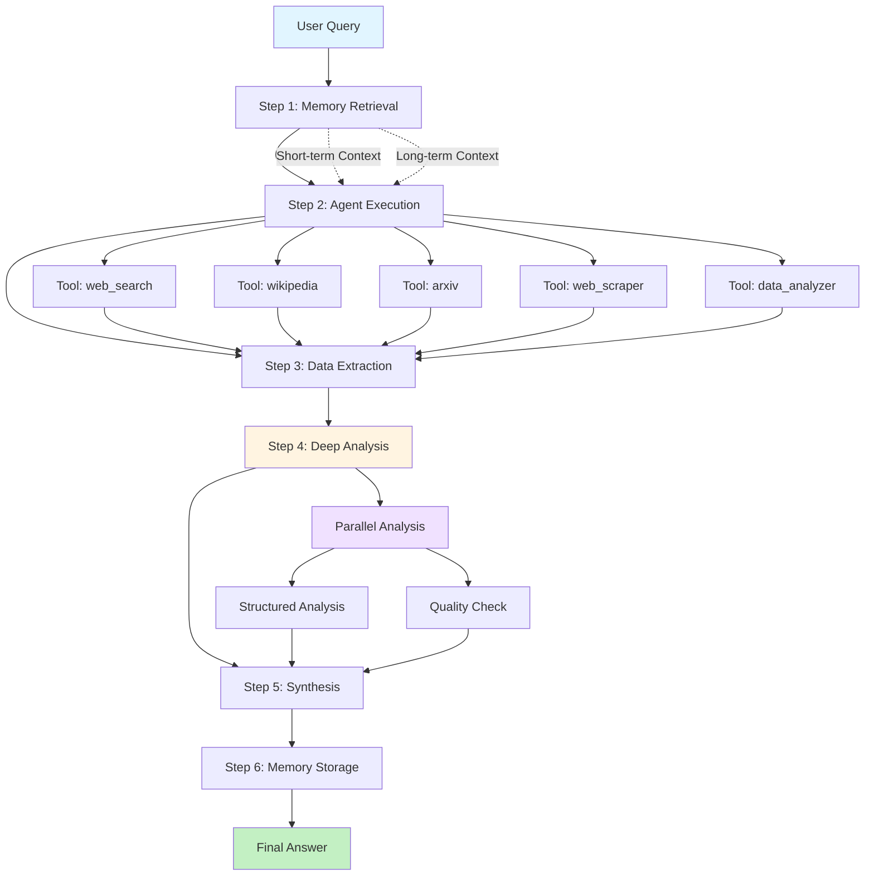
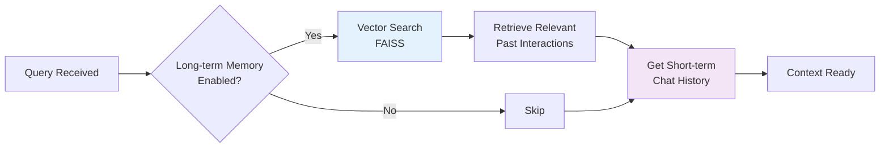
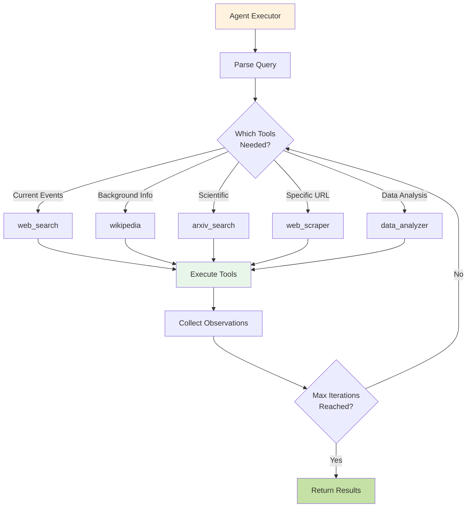
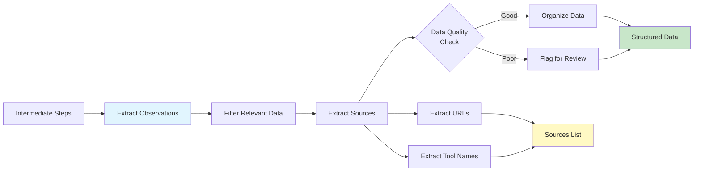
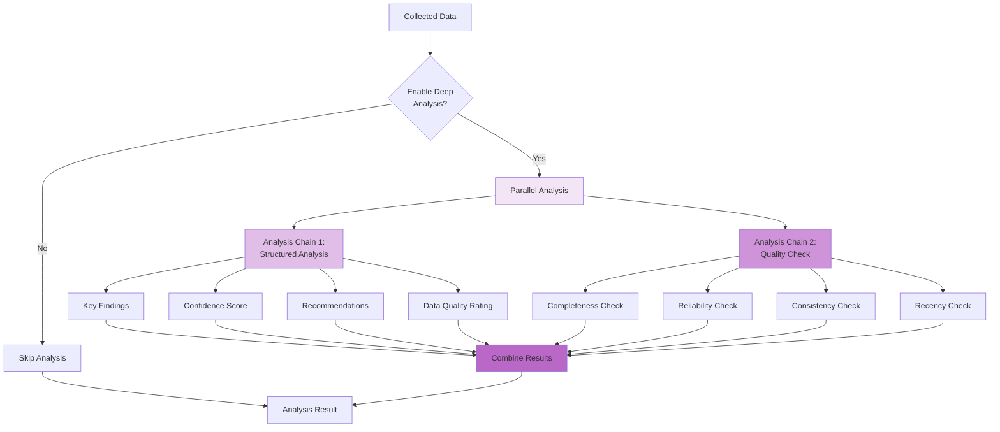
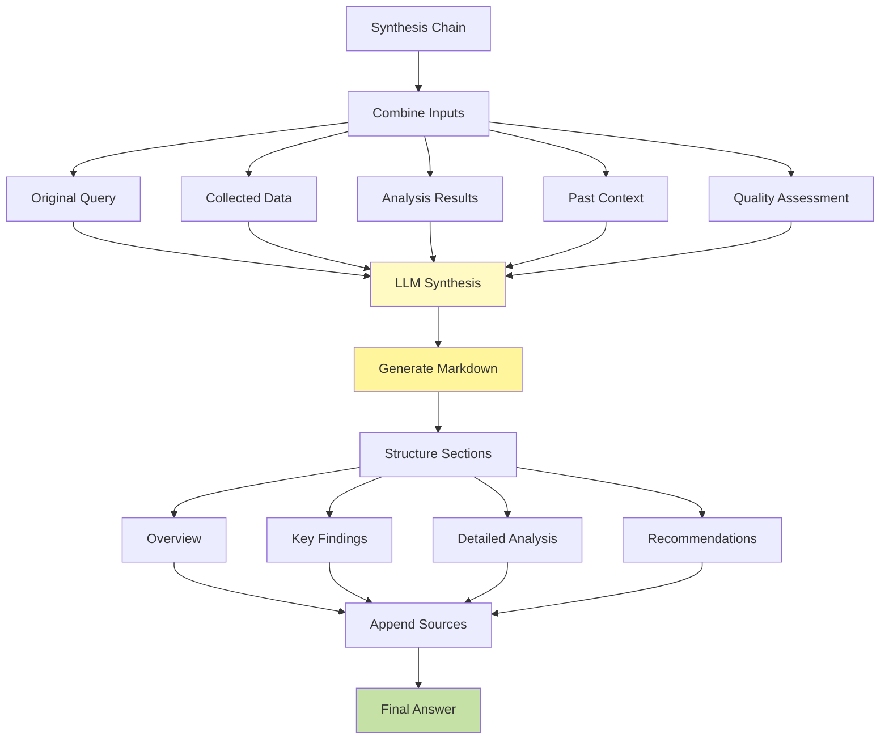
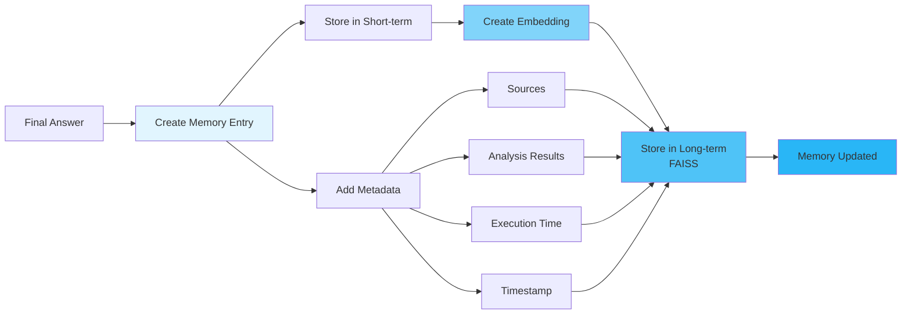
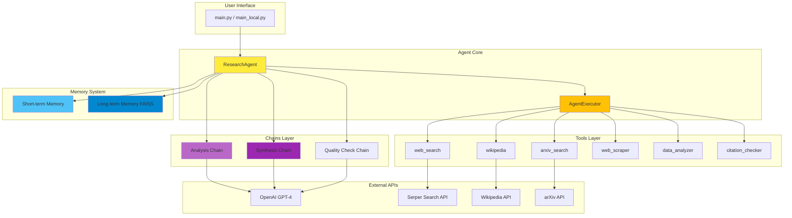

# 🤖 AI Research Assistant Agent

A production-level AI research assistant built with LangChain LCEL (LangChain Expression Language) that intelligently gathers, analyzes, and synthesizes information from multiple sources to provide comprehensive research answers.

## ✨ Features

### 🔍 **Multi-Source Information Gathering**
- **Web Search**: Real-time information from search engines via Serper API
- **Wikipedia**: Background knowledge and encyclopedic information
- **Academic Papers**: Scientific research from arXiv
- **Web Scraping**: Detailed content extraction from specific URLs
- **Data Analysis**: Numerical and statistical analysis capabilities

### 🧠 **Intelligent Processing Pipeline**
1. **Information Collection**: Gathers data from multiple relevant sources
2. **Critical Analysis**: Evaluates reliability and cross-checks facts
3. **Quality Assessment**: Validates data completeness, consistency, and recency
4. **Synthesis**: Combines insights into coherent, well-structured answers
5. **Citation**: Properly cites sources for transparency

### 💾 **Hybrid Memory System**
- **Short-term Memory**: Maintains conversation context (last 10 messages)
- **Long-term Memory**: Stores and retrieves past interactions using vector embeddings
- **Context-aware**: Leverages relevant past research to enhance current queries

### ⚡ **Advanced Capabilities**
- Parallel processing for faster analysis
- Structured output with confidence scores
- Real-time progress indicators
- Rich console formatting with Markdown support
- Error handling and retry mechanisms
- Configurable execution parameters

## 🏗️ Architecture

The agent follows a modular, production-ready architecture:

```
AI-Research-Assistant-Agent/
├── agents/
│   ├── research_agent.py    # Main agent orchestrator
│   ├── tools.py              # Research tools (search, scrape, analyze)
│   └── memory.py             # Hybrid memory system
├── chains/
│   ├── analysis_chain.py     # Deep analysis and comparison
│   ├── synthesis_chain.py    # Final answer synthesis
│   └── report_chain.py       # Report generation
├── utils/
│   ├── parsers.py            # Output parsers
│   └── validators.py         # Input validators
├── config.py                 # Configuration management
├── main.py                   # Production entry point
├── main_local.py             # Demo mode (no API calls)
└── requirements.txt          # Dependencies
```

## 🔄 Agent Workflow

### High-Level Execution Pipeline

The agent follows a sophisticated 6-step pipeline to process research queries:



### Detailed Step-by-Step Flow

#### **Step 1: Memory Retrieval** 🧠


**What Happens:**
- Searches long-term memory (FAISS vector store) for relevant past research
- Retrieves last 10 messages from short-term memory
- Combines context to inform current research

**Code Reference:**
```python
past_context = self.memory.get_relevant_context(query)
chat_history = self.memory.get_short_term_history()
```

---

#### **Step 2: Agent Execution** 🤖


**What Happens:**
- OpenAI function calling determines which tools to use
- Agent iteratively calls tools based on findings (max 5 iterations)
- Each tool returns observations (search results, articles, data)
- Agent decides if more information is needed

**Code Reference:**
```python
agent_result = await self.agent_executor.ainvoke({
    "input": query,
    "chat_history": chat_history,
    "tools": self.tools
})
```

---

#### **Step 3: Data Extraction** 📊


**What Happens:**
- Parses all tool execution results
- Extracts meaningful data from observations
- Identifies and catalogues sources (URLs, tool names)
- Filters out low-quality or irrelevant information

**Code Reference:**
```python
collected_data = self._extract_data_from_steps(intermediate_steps)
sources = self._extract_sources(intermediate_steps)
```

---

#### **Step 4: Deep Analysis** 🔬


**What Happens:**
- **Parallel Processing**: Runs two analysis chains simultaneously using `RunnableParallel`
  
  **Structured Analysis:**
  - Extracts key findings
  - Calculates confidence score (0-1)
  - Generates actionable recommendations
  - Rates data quality (High/Medium/Low)
  
  **Quality Check:**
  - Validates data completeness
  - Assesses source reliability
  - Checks for contradictions
  - Evaluates information recency

**Code Reference:**
```python
parallel_analysis = RunnableParallel({
    "structured_analysis": self.analysis_chain,
    "quality_check": self._create_quality_check_chain()
})
results = await parallel_analysis.ainvoke(analysis_input)
```

**Output Schema (Pydantic):**
```python
{
    "key_findings": List[str],
    "confidence_score": float,
    "data_quality": str,
    "recommendations": List[str],
    "sources_used": List[str]
}
```

---

#### **Step 5: Synthesis** ✨


**What Happens:**
- Synthesis chain combines ALL inputs into coherent answer
- GPT-4 generates well-structured Markdown output
- Automatically formats with sections:
  - **Overview**: High-level summary
  - **Key Findings**: Bullet points with insights
  - **Detailed Analysis**: In-depth exploration
  - **Recommendations**: Actionable next steps
- Appends source citations at the end

**Code Reference:**
```python
final_answer = await self.synthesis_chain.ainvoke({
    "original_query": query,
    "findings": collected_data,
    "analysis": json.dumps(analysis_result),
    "comparison": quality_assessment,
    "past_context": past_context
})
```

---

#### **Step 6: Memory Storage** 💾


**What Happens:**
- **Short-term Memory**: Adds query + answer to chat history (last 10 retained)
- **Long-term Memory**: 
  - Creates vector embedding of the interaction
  - Stores in FAISS for semantic search
  - Includes metadata (sources, execution time, etc.)
- Future queries can retrieve this context

**Code Reference:**
```python
self.memory.add_interaction(
    query=query,
    response=final_answer,
    metadata={
        "sources": sources,
        "analysis": analysis_result,
        "execution_time": execution_time
    }
)
```

---

### Component Interaction Diagram



### Key Design Patterns

#### 1. **LCEL (LangChain Expression Language)**
The agent extensively uses LCEL for composability:
- `RunnableParallel`: Run analysis chains in parallel
- `RunnablePassthrough`: Pass data through pipeline
- `RunnableBranch`: Conditional execution paths

#### 2. **Function Calling (OpenAI Tools)**
- Agent autonomously decides which tools to use
- Structured output ensures reliable parsing
- Supports multi-step reasoning

#### 3. **Hybrid Memory Architecture**
- **Short-term**: Fast access to recent context
- **Long-term**: Semantic search for relevant history
- **Automatic**: No manual memory management needed

#### 4. **Error Resilience**
- Try-catch blocks at each step
- Graceful degradation (fallback to simpler modes)
- Retry logic for API calls

---

## 🚀 Quick Start

### Prerequisites

- Python 3.8+
- OpenAI API key
- Serper API key (for web search)

### Installation

1. **Clone the repository**
```bash
git clone https://github.com/Hills081199/AI-Research-Assistant-Agent.git
cd AI-Research-Assistant-Agent
```

2. **Install dependencies**
```bash
pip install -r requirements.txt
```

3. **Set up environment variables**

Create a `.env` file in the root directory:
```env
OPENAI_API_KEY=your_openai_api_key_here
SERPER_API_KEY=your_serper_api_key_here
```

### Usage

#### **Option 1: Demo Mode (No API Required)**

Run the demo with pre-configured example:
```bash
python main_local.py
```

This will run a demo research query without making any API calls, perfect for testing the UI and understanding the output format.

#### **Option 2: Production Mode (API Required)**

**Interactive Mode:**
```bash
python main.py
```

Then choose from example queries or enter your own research question.

**Single Query Mode:**

Edit `main.py` to set your query, then run:
```bash
python main.py
```

## 📊 Example Output

When you run a research query, you'll get:

```markdown
# Research Results

## 🎯 Overview
[Comprehensive overview of the topic]

## 📈 Key Findings
- Finding 1 with data
- Finding 2 with statistics
- Finding 3 with insights

## 💡 Recommendations
- Actionable recommendation 1
- Actionable recommendation 2

---
Execution time: 2.5s
Intermediate steps: 8
Confidence: 85%
Data Quality: High

Sources:
1. https://example.com/source1
2. Tool: wikipedia
3. Tool: web_search
```

## ⚙️ Configuration

Customize the agent behavior in `config.py`:

```python
class AgentConfig:
    # API Keys
    openai_api_key: str
    serper_api_key: str
    
    # Model Settings
    model_name: str = "gpt-4-turbo-preview"
    temperature: float = 0.1
    max_tokens: int = 4000
    
    # Agent Settings
    max_iterations: int = 5
    max_execution_time: int = 300  # seconds
    
    # Memory Settings
    memory_window: int = 10
    enable_long_term_memory: bool = True
    
    # Search Settings
    max_search_results: int = 5
    search_timeout: int = 30
    
    # Parallel Execution
    max_concurrent_tasks: int = 3
```

## 🛠️ Available Tools

| Tool | Description | Use Case |
|------|-------------|----------|
| **web_search** | Google search via Serper API | Current events, general information |
| **wikipedia** | Wikipedia article search | Background knowledge, overviews |
| **arxiv_search** | Academic paper search | Scientific research, technical topics |
| **web_scraper** | Extract content from URLs | Detailed information from specific sites |
| **data_analyzer** | Analyze numerical data | Statistics, trends, comparisons |
| **citation_checker** | Verify citations | Fact-checking, source validation |

## 📝 Core Components

### Research Agent (`research_agent.py`)
- Orchestrates the entire research pipeline
- Manages tool execution and memory
- Coordinates analysis and synthesis chains

### Tools (`tools.py`)
- Implements 6+ specialized research tools
- Handles API integrations
- Provides fallback mechanisms

### Memory System (`memory.py`)
- Short-term: Recent conversation context
- Long-term: Vector-based retrieval using FAISS
- Automatic summarization and storage

### Analysis Chain (`analysis_chain.py`)
- Structured data analysis with Pydantic models
- Parallel processing for efficiency
- Confidence scoring and quality metrics

### Synthesis Chain (`synthesis_chain.py`)
- Combines findings from multiple sources
- Generates well-formatted Markdown output
- Integrates analysis insights

## 🎯 Use Cases

- **Academic Research**: Gather and synthesize academic papers
- **Market Analysis**: Research market trends and opportunities
- **Technical Investigation**: Deep dive into technical topics
- **Fact Checking**: Verify claims across multiple sources
- **Competitive Analysis**: Compare approaches and solutions
- **Knowledge Discovery**: Explore new topics systematically

## 🔧 Advanced Features

### Parallel Processing
The agent uses `RunnableParallel` to run multiple analysis chains simultaneously:
- Structured analysis
- Quality checking
- Source verification

### Error Handling
- Automatic retries with exponential backoff
- Graceful degradation when tools fail
- Parsing error recovery

### Rich Console UI
- Progress indicators during research
- Formatted Markdown output
- Color-coded status messages
- Metadata display

## 📦 Dependencies

Key dependencies:
- **langchain**: Core framework
- **langchain-openai**: OpenAI integration
- **openai**: GPT models
- **faiss-cpu**: Vector similarity search
- **rich**: Beautiful terminal output
- **pydantic**: Data validation
- **wikipedia**: Wikipedia API
- **arxiv**: Academic paper access

See `requirements.txt` for the complete list.

## 🤝 Contributing

Contributions are welcome! Areas for improvement:
- Additional research tools
- Enhanced analysis capabilities
- New chain implementations
- UI/UX improvements
- Documentation

## 📄 License

MIT License - feel free to use this project for learning and production.

## 👨‍💻 Author

**Hills081199**

Part of the "Fundamentals of Building AI Agents" course project.

## 🙏 Acknowledgments

Built with:
- [LangChain](https://www.langchain.com/) - LLM application framework
- [OpenAI](https://openai.com/) - GPT models
- [Serper](https://serper.dev/) - Search API
- [Rich](https://rich.readthedocs.io/) - Terminal formatting

---

**Note**: This is a learning project demonstrating production-level AI agent patterns including LCEL chains, tool usage, memory management, and sophisticated prompt engineering.

For questions or issues, please open an issue on GitHub.